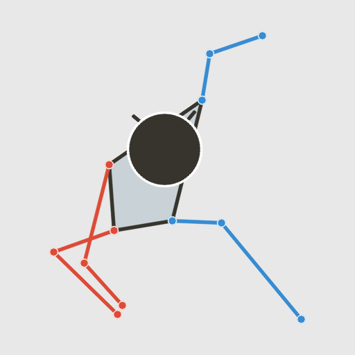
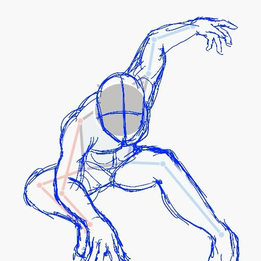
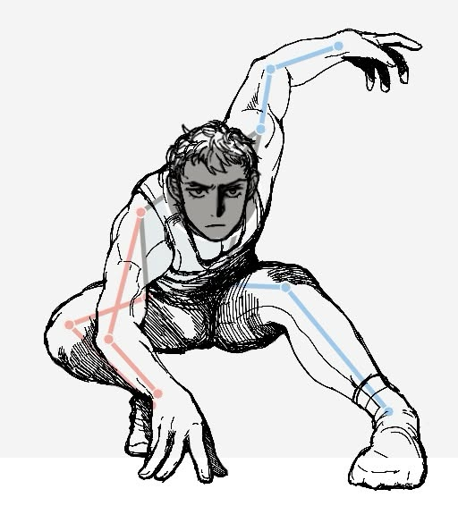
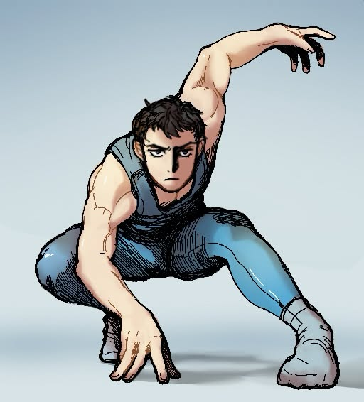

# PoseHelper

ML-powered human pose reference tool for artists. Upload a photo, get a predicted yoga pose label and a clean skeleton mannequin you can use as a drawing reference. 

The yoga pose label isn't just a fun fact. If PoseHelper tells you your reference photo is 90% similar to a Warrior2 pose, you now have a search term. You can look up 'Warrior2' and find dozens of reference photos from different angles, with different clothing, showing the muscle groups in detail — all without having to describe the pose yourself!

PoseHelper uses MoveNet SinglePose Thunder, which is optimized for single-person images. For best results, upload photos with one clearly visible person and a full body in frame. Multi-person support would require MoveNet MultiPose, which is a planned future improvement.

**[Watch the full presentation demo](https://youtu.be/kZ_Mgruca44)**


## Live Demo

Try it here: https://huggingface.co/spaces/OspreyMoby/posehelper

Upload any single-person photo and get a clean skeleton mannequin reference instantly.


## From Reference to Artwork

Here's PoseHelper in action — from a photo of a challenging and dynamic pose all the way to a finished digital painting.

**Input photo + generated mannequin**


**Step-by-step art process**

<table>
  <tr>
    <td align="center" width="25%">
      <br/>
      <b>Step 1 — Download the mannequin</b><br/>
      <sub>Save the generated skeleton as your drawing guide</sub>
    </td>
    <td align="center" width="25%">
      <br/>
      <b>Step 2 — Draft sketch</b><br/>
      <sub>Use the keypoints and body structure as a foundation</sub>
    </td>
    <td align="center" width="25%">
      <br/>
      <b>Step 3 — Line art</b><br/>
      <sub>Refine the lines and cross-check proportions against the mannequin</sub>
    </td>
    <td align="center" width="25%">
      <br/>
      <b>Step 4 — Finished</b><br/>
      <sub>Color, shading, and final details</sub>
    </td>
  </tr>
</table>

**Full time-lapse (Procreate recording)**

[](https://www.youtube.com/shorts/Uhw-MW6Wb68)

## Requirements

- Python 3.9+
- See `requirements.txt` for all dependencies

## Setup

```bash
pip install -r requirements.txt
```

### Model files

| File | Description |
|---|---|
| `mlp_classifier.pkl` | Trained sklearn MLP classifier |
| `scaler.pkl` | Fitted StandardScaler |
| `classes.json` | Class list, e.g. `["downdog","goddess","plank","tree","warrior2"]` |

MoveNet Thunder is downloaded automatically from TF Hub on first run (~200 MB, cached locally).

## Run

```bash
uvicorn app.main:app --reload
```

Open [http://localhost:8000](http://localhost:8000) in your browser.

## API

### `POST /predict`

| Field | Type | Description |
|---|---|---|
| `file` | image upload | JPEG, PNG, or WEBP |

**Response JSON**

```json
{
  "label":           "warrior2",
  "confidence":      0.94,
  "all_scores":      { "downdog": 0.01, "goddess": 0.02, ... },
  "mannequin_image": "<base64 PNG>"
}
```

## Feature vector note

`app/model.py` feeds the classifier a 34-element vector — the `[y, x]` pair for each of MoveNet's 17 keypoints, flattened in keypoint order. If your training CSV used a different column layout (e.g. `x` before `y`, or included confidence scores), adjust the slice in `predict_pose()`:

```python
# current (y, x) order — 34 features
features = keypoints[:, :2].flatten()

# swap to (x, y) order
features = keypoints[:, [1, 0]].flatten()

# include confidence — 51 features
features = keypoints.flatten()
```

## Main Code Locations

| What | Where |
|---|---|
| Training notebook | `notebooks/posehelper_training.ipynb` |
| MoveNet inference + classifier | `app/model.py` |
| Mannequin renderer | `app/renderer.py` |
| FastAPI endpoint | `app/main.py` |
| Frontend UI | `frontend/index.html` |

## Project layout

```
posehelper/
├── app/
│   ├── main.py       FastAPI app, /predict endpoint
│   ├── model.py      MoveNet inference + MLP classifier
│   └── renderer.py   OpenCV skeleton mannequin
├── frontend/
│   └── index.html    Single-page UI
├── models/           Drop mlp_classifier.pkl, scaler.pkl, classes.json here
├── data/             Drop yoga_keypoints.csv here
└── notebooks/        Training notebooks
```
